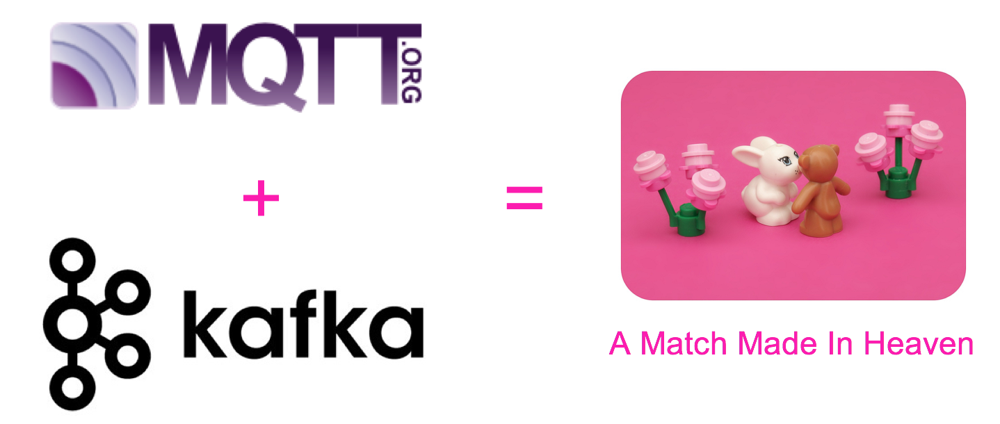

# Deep Learning UDF for KSQL for Streaming Anomaly Detection of MQTT IoT Sensor Data

I built a KSQL UDF for sensor analytics. It leverages the new [API features of KSQL to build UDF / UDAF functions easily with Java](https://docs.confluent.io/current/ksql/docs/udf.html) to do continuous stream processing on incoming events.
If you want to build your own UDF, please check out this blog post for a detailed "how to" and potential issues during development and testing: [How to Build a UDF and/or UDAF in KSQL 5.0](https://www.confluent.io/blog/build-udf-udaf-ksql-5-0).
 
## Use Case: Connected Cars - Real Time Streaming Analytics using Deep Learning
Continuously process millions of events from connected devices (sensors of cars in this example):

## Architecture: Sensor Data via Confluent MQTT Proxy to Kafka Cluster for KSQL Processing and Real Time Analytics
This project focuses on the ingestion of data into Kafka via MQTT and processing of data via KSQL:

## Live Demo Video - MQTT with Kafka Connect and MQTT Proxy
If you want to see Apache Kafka / MQTT integration in a video, please check out the following 15min recording showing a demo my two Github examples:

## Source Code
Here is the full source code for the [Anomaly Detection KSQL UDF](https://github.com/kaiwaehner/ksql-udf-deep-learning-mqtt-iot/blob/master/src/main/java/com/github/megachucky/kafka/streams/machinelearning/Anomaly.java).

It is pretty easy to develop UDFs. Just implement the function in one Java method within a UDF class:

                @Udf(description = "apply analytic model to sensor input")
                public String anomaly(String sensorinput){ "YOUR LOGIC" }

## How to run it?

### Requirements
The code is developed and tested on Mac and Linux operating systems. As Kafka does not support and work well on Windows, this is not tested at all.

- Java 8
- [Confluent Platform 5.0+](https://www.confluent.io/download/) (Confluent Enterprise if you want to use the Confluent MQTT Proxy, Confluent Open Source if you just want to run the KSQL UDF and send data via kafkacat instead of MQTT)
- MQTT Client (I use [Mosquitto](https://mosquitto.org/download/) in the demo as MQTT Client to publish MQTT messages - I don't even start the MQTT server! Thus, you can also use any other MQTT Client instead.)
- [kafkacat](https://github.com/edenhill/kafkacat) (optional - if you do not want to use MQTT Producers, and of course you can also use kafka-console-producer instead, but kafkacat is much more comfortable)

### Step-by-step demo
[Install Confluent Platform](https://www.confluent.io/download/) and [Mosquitto](https://mosquitto.org/download/) (or any other MQTT Client). Then follow these steps to [deploy the UDF, create MQTT events and process them via KSQL leveraging the analytic model](https://github.com/kaiwaehner/ksql-udf-deep-learning-mqtt-iot/blob/master/live-demo-ksql-udf-deep-learning-mqtt-iot.adoc).

## Other information and projects related to Kafka and MQTT
If you want to find more details about Kafka + MQTT integration, take a look at my slides from Kafka Summit 2018 in San Francisco: [IoT Integration with MQTT and Apache Kafka](https://www.slideshare.net/KaiWaehner/iot-integration-with-mqtt-and-apache-kafka). The video recording is available on the website of Kafka Summit for free: [Kafka MQTT Integration - Video Recording](https://www.confluent.io/kafka-summit-sf18/processing-iot-data-from-end-to-end).

To see the other part (integration with sink applications like Elasticsearch / Grafana), please take a look at the project "[KSQL for streaming IoT data](https://github.com/kaiwaehner/ksql-fork-with-deep-learning-function)", which shows how to realize the integration with ElasticSearch via Kafka Connect.

The Github project [Apache Kafka + Kafka Connect + MQTT Connector + Sensor Data](https://github.com/kaiwaehner/kafka-connect-iot-mqtt-connector-example) also integrates with MQTT devices. Though, this project uses Confluent's MQTT Connector for Kafka Connect, i.e. a different approach where you use a MQTT Broker in between the devices and Kafka.

