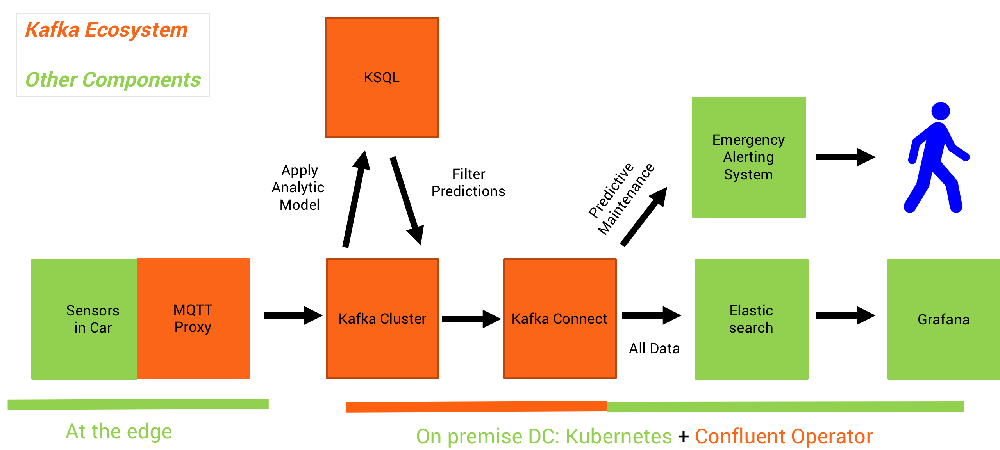

# Deep Learning UDF for KSQL for Streaming Anomaly Detection of MQTT IoT Sensor Data

I built a KSQL UDF for sensor analytics. It leverages the new [API features of KSQL to build UDF / UDAF functions easily with Java](https://docs.confluent.io/current/ksql/docs/udf.html).

## Use Case: Connected Cars - Real Time Analytics using Deep Learning

## Architecture: Sensor Data via Confluent MQTT Proxy to Kafka Cluster for KSQL Processing and Real Time Analytics

## Source Code
Here is the full source code for the [Anomaly Detection KSQL UDF](https://github.com/kaiwaehner/ksql-udf-deep-learning-mqtt-iot/blob/master/src/main/java/com/github/megachucky/kafka/streams/machinelearning/Anomaly.java).

It is pretty easy to develop UDFs. Just implement the function in one Java method within a UDF class:

                @Udf(description = "apply analytic model to sensor input")
                public String anomaly(String sensorinput){ "YOUR LOGIC" }

## How to run it?
TODO

